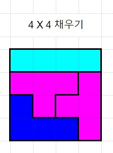

# 문제

[테트로미노](https://en.wikipedia.org/wiki/Tetromino)는 테트리스에서 쓰는 정사각형 4개를 이어 붙여서 만든 블록을 의미한다.
총 7종류의 모양으로 되어있다.

이 테트로미노를 이용해서 `6 X 6` 크기의 정사각형을 가운데 `2 X 2`의 빈 공간만 남기고 채우려고 한다.
채워야 하는 공간은 총 32칸이기 때문에 7종류의 블럭 중 하나는 한번 더 사용할 수 있다.

각 블럭마다 고유의 알파벳으로 표시한다. 블럭이 어디에 위치했는지를 이 알파벳을 통해 표시하면 된다.


이렇게 채웠을 경우에는,
```buildoutcfg
IIII
LJJJ
LZZJ
LLZZ
```
이와 같이 대문자 알파벳을 이용해서 출력하면 된다.



와 같이 하나의 블럭을 중복해야 할 경우에는
```buildoutcfg
IIII
TTTt
JTtt
JJJt
```
처럼 중복된 블럭은 소문자를 이용해서 표현하면 된다.

그 외의 블럭의 알파벳은 [테트로미노 위키](https://en.wikipedia.org/wiki/Tetromino#One-sided_tetrominoes)에서 확인할 수 있다.
