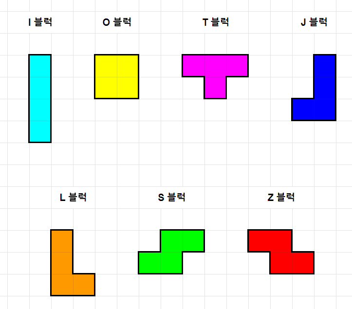
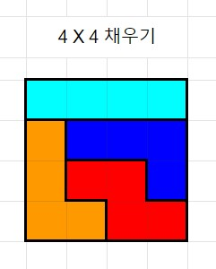
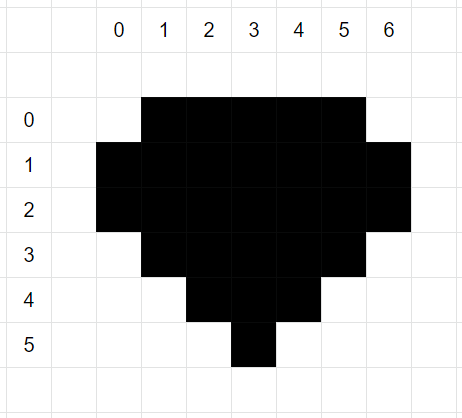

# 문제

[테트로미노](https://en.wikipedia.org/wiki/Tetromino)는 테트리스에서 쓰는 정사각형 4개를 이어 붙여서 만든 블록을 의미합니다.
뒤집기는 불가능하고 회전만 가능한 경우에는 총 7종류의 모양으로 되어 있습니다. 
각자의 블럭은 비슷한 알파벳을 이용해서 이름을 붙입니다.



이 테트로미노를 이용해 여러 개의 사각형으로 이뤄진 격자 공간을 채울 수 있습니다.
4 X 4 모양의 정사각형을 채우는 것을 예시로 들어보겠습니다.



이렇게 채웠을 경우에는,
```buildoutcfg
IIII
LJJJ
LZZJ
LLZZ
```
이와 같이 대문자 알파벳을 이용해서 출력하면 됩니다.

이 테트로미노를 이용해서 다음 모양으로 생긴 공긴을 채우는 방법을 출력하려고 합니다.



자연수 `N`이 주어졌을 때, 공간을 채울 수 있는 `N`가지의 경우의 수를 출력하면 됩니다.
출력한 결과는 서로 달라야 하며,
경우의 수를 하나 출력한 뒤 빈 줄을 출력해서 구분을 해주어야 합니다.

`N`이 실제 배치활 수 있는 경우의 수보다 클 경우 더 이상 출력하지 않아도 됩니다.
예로, 만약 12가지 밖에 답이 없지만 주어진 수가 `N=20`인 경우 12가지만 출력하면 됩니다.

# 제한사항
## 테스트 셋1
* `N = 2`
## 테스트 셋2
* `N = 15`
* 채울 수 있는 경우의 수가 10가지라서 모두 출력하는 문제와 같다.
